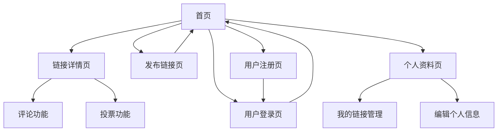

# 链接聚合应用产品需求文档

## 1. 产品概述
一个类似Reddit的链接聚合平台，用户可以分享、讨论和投票评价各种链接内容。
该产品旨在为用户提供一个开放的信息分享和讨论社区，通过投票机制筛选优质内容，促进有价值信息的传播。
目标是打造一个活跃的中文内容聚合社区，提升用户获取和分享信息的效率。

## 2. 核心功能

### 2.1 用户角色
| 角色 | 注册方式 | 核心权限 |
|------|----------|----------|
| 游客用户 | 无需注册 | 可浏览链接和评论内容 |
| 注册用户 | 邮箱注册 | 可发布链接、投票、评论、编辑个人资料 |

### 2.2 功能模块
我们的链接聚合应用包含以下主要页面：
1. **首页**：导航栏、链接列表、分页功能
2. **链接详情页**：链接信息、投票按钮、评论区域
3. **发布链接页**：链接表单、标题和URL输入
4. **用户注册页**：注册表单、邮箱验证
5. **用户登录页**：登录表单、记住密码
6. **个人资料页**：用户信息、我的链接、编辑资料

### 2.3 页面详情
| 页面名称 | 模块名称 | 功能描述 |
|----------|----------|----------|
| 首页 | 导航栏 | 显示网站Logo、登录/注册按钮、用户菜单 |
| 首页 | 链接列表 | 展示所有链接，包含标题、URL、投票数、评论数、发布时间 |
| 首页 | 分页功能 | 支持链接列表分页浏览，每页显示20条记录 |
| 链接详情页 | 链接信息 | 显示完整链接信息、发布者、发布时间 |
| 链接详情页 | 投票系统 | 提供点赞和踩按钮，显示当前投票统计 |
| 链接详情页 | 评论区域 | 显示所有评论、评论表单、评论数量统计 |
| 发布链接页 | 链接表单 | 提供标题和URL输入框，表单验证和提交 |
| 用户注册页 | 注册表单 | 用户名、邮箱、密码输入，表单验证 |
| 用户登录页 | 登录表单 | 邮箱/用户名、密码输入，记住登录状态 |
| 个人资料页 | 用户信息 | 显示用户基本信息、注册时间、发布统计 |
| 个人资料页 | 我的链接 | 显示用户发布的所有链接，支持编辑和删除 |
| 个人资料页 | 编辑资料 | 修改用户名、邮箱、密码等个人信息 |

## 3. 核心流程

**游客用户流程：**
游客可以浏览首页查看所有链接，点击链接查看详情和评论，但无法进行投票、评论或发布操作。需要注册登录后才能参与互动。

**注册用户流程：**
用户注册登录后，可以在首页浏览链接，点击发布按钮创建新链接，对感兴趣的链接进行投票，在详情页发表评论。用户可以在个人资料页管理自己发布的链接，包括编辑和删除操作。

## 4. 用户界面设计

### 4.1 设计风格
- 主色调：蓝色(#3B82F6)，辅助色：灰色(#6B7280)
- 按钮样式：圆角按钮，悬停效果
- 字体：系统默认字体，标题16px，正文14px
- 布局风格：卡片式设计，顶部导航栏
- 图标风格：简洁的线性图标，支持点赞、评论、分享等操作

### 4.2 页面设计概览
| 页面名称 | 模块名称 | UI元素 |
|----------|----------|--------|
| 首页 | 导航栏 | 蓝色背景，白色文字，Logo左对齐，用户菜单右对齐 |
| 首页 | 链接列表 | 白色卡片背景，灰色边框，标题蓝色链接，投票按钮橙色 |
| 链接详情页 | 投票系统 | 垂直排列的上下箭头按钮，中间显示投票数 |
| 链接详情页 | 评论区域 | 浅灰色背景，评论间有分割线，头像圆形显示 |
| 发布链接页 | 表单 | 简洁的输入框设计，蓝色提交按钮，错误提示红色 |
| 登录注册页 | 表单 | 居中布局，白色背景卡片，蓝色主按钮 |

### 4.3 响应式设计
采用移动端优先的响应式设计，在桌面端提供更好的浏览体验，支持触摸操作优化，确保在各种设备上都有良好的用户体验。