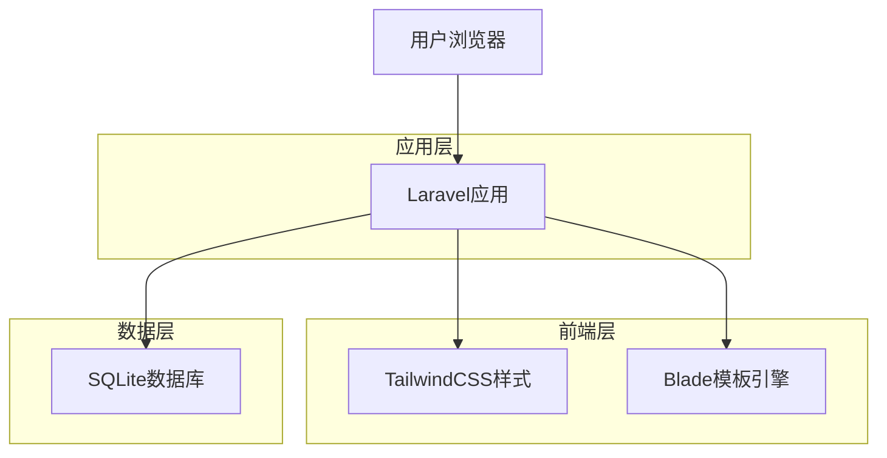
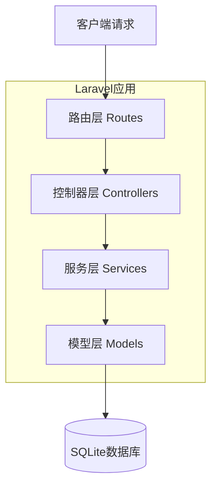
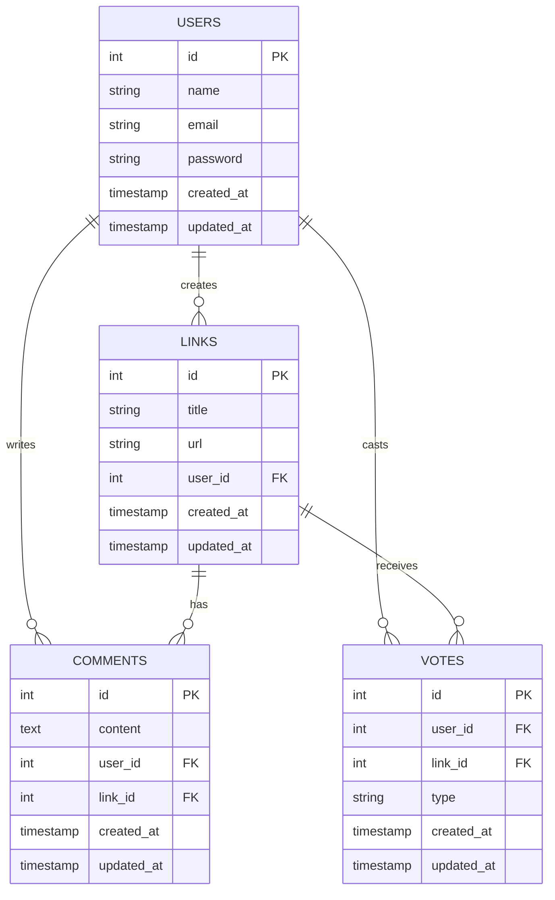

# 链接聚合应用技术架构文档

## 1. 架构设计



## 2. 技术描述
- 后端框架：Laravel@10 + SQLite数据库
- 前端样式：TailwindCSS@3 + Blade模板
- 包管理：Composer + npm
- 认证系统：Laravel内置认证

## 3. 路由定义
| 路由 | 用途 |
|------|------|
| / | 首页，显示链接列表和导航 |
| /links/{id} | 链接详情页，显示链接信息和评论 |
| /links/create | 发布链接页面 |
| /login | 用户登录页面 |
| /register | 用户注册页面 |
| /profile | 个人资料页面，显示用户信息和管理链接 |
| /links/{id}/edit | 编辑链接页面 |

## 4. API定义

### 4.1 核心API

用户认证相关
```
POST /login
```

请求参数：
| 参数名 | 参数类型 | 是否必需 | 描述 |
|--------|----------|----------|------|
| email | string | true | 用户邮箱 |
| password | string | true | 用户密码 |

响应：
| 参数名 | 参数类型 | 描述 |
|--------|----------|------|
| success | boolean | 登录是否成功 |
| message | string | 响应消息 |

链接管理相关
```
POST /links
```

请求参数：
| 参数名 | 参数类型 | 是否必需 | 描述 |
|--------|----------|----------|------|
| title | string | true | 链接标题 |
| url | string | true | 链接地址 |

投票系统相关
```
POST /links/{id}/vote
```

请求参数：
| 参数名 | 参数类型 | 是否必需 | 描述 |
|--------|----------|----------|------|
| type | string | true | 投票类型：upvote或downvote |

评论系统相关
```
POST /links/{id}/comments
```

请求参数：
| 参数名 | 参数类型 | 是否必需 | 描述 |
|--------|----------|----------|------|
| content | string | true | 评论内容 |

## 5. 服务器架构图



## 6. 数据模型

### 6.1 数据模型定义



### 6.2 数据定义语言

用户表 (users)
```sql
-- 创建用户表
CREATE TABLE users (
    id INTEGER PRIMARY KEY AUTOINCREMENT,
    name VARCHAR(255) NOT NULL,
    email VARCHAR(255) UNIQUE NOT NULL,
    email_verified_at TIMESTAMP NULL,
    password VARCHAR(255) NOT NULL,
    remember_token VARCHAR(100) NULL,
    created_at TIMESTAMP DEFAULT CURRENT_TIMESTAMP,
    updated_at TIMESTAMP DEFAULT CURRENT_TIMESTAMP
);

-- 创建索引
CREATE INDEX idx_users_email ON users(email);
```

链接表 (links)
```sql
-- 创建链接表
CREATE TABLE links (
    id INTEGER PRIMARY KEY AUTOINCREMENT,
    title VARCHAR(255) NOT NULL,
    url TEXT NOT NULL,
    user_id INTEGER NOT NULL,
    created_at TIMESTAMP DEFAULT CURRENT_TIMESTAMP,
    updated_at TIMESTAMP DEFAULT CURRENT_TIMESTAMP,
    FOREIGN KEY (user_id) REFERENCES users(id) ON DELETE CASCADE
);

-- 创建索引
CREATE INDEX idx_links_user_id ON links(user_id);
CREATE INDEX idx_links_created_at ON links(created_at DESC);
```

评论表 (comments)
```sql
-- 创建评论表
CREATE TABLE comments (
    id INTEGER PRIMARY KEY AUTOINCREMENT,
    content TEXT NOT NULL,
    user_id INTEGER NOT NULL,
    link_id INTEGER NOT NULL,
    created_at TIMESTAMP DEFAULT CURRENT_TIMESTAMP,
    updated_at TIMESTAMP DEFAULT CURRENT_TIMESTAMP,
    FOREIGN KEY (user_id) REFERENCES users(id) ON DELETE CASCADE,
    FOREIGN KEY (link_id) REFERENCES links(id) ON DELETE CASCADE
);

-- 创建索引
CREATE INDEX idx_comments_link_id ON comments(link_id);
CREATE INDEX idx_comments_user_id ON comments(user_id);
```

投票表 (votes)
```sql
-- 创建投票表
CREATE TABLE votes (
    id INTEGER PRIMARY KEY AUTOINCREMENT,
    user_id INTEGER NOT NULL,
    link_id INTEGER NOT NULL,
    type VARCHAR(10) NOT NULL CHECK (type IN ('upvote', 'downvote')),
    created_at TIMESTAMP DEFAULT CURRENT_TIMESTAMP,
    updated_at TIMESTAMP DEFAULT CURRENT_TIMESTAMP,
    FOREIGN KEY (user_id) REFERENCES users(id) ON DELETE CASCADE,
    FOREIGN KEY (link_id) REFERENCES links(id) ON DELETE CASCADE,
    UNIQUE(user_id, link_id)
);

-- 创建索引
CREATE INDEX idx_votes_link_id ON votes(link_id);
CREATE INDEX idx_votes_user_id ON votes(user_id);

-- 初始化数据
INSERT INTO users (name, email, password) VALUES 
('张三', 'zhangsan@example.com', '$2y$10$92IXUNpkjO0rOQ5byMi.Ye4oKoEa3Ro9llC/.og/at2.uheWG/igi'),
('李四', 'lisi@example.com', '$2y$10$92IXUNpkjO0rOQ5byMi.Ye4oKoEa3Ro9llC/.og/at2.uheWG/igi'),
('王五', 'wangwu@example.com', '$2y$10$92IXUNpkjO0rOQ5byMi.Ye4oKoEa3Ro9llC/.og/at2.uheWG/igi');

INSERT INTO links (title, url, user_id) VALUES 
('Laravel官方文档', 'https://laravel.com/docs', 1),
('TailwindCSS样式框架', 'https://tailwindcss.com', 2),
('GitHub开源项目', 'https://github.com', 3);

INSERT INTO comments (content, user_id, link_id) VALUES 
('这个文档很有用！', 2, 1),
('TailwindCSS确实很好用', 1, 2),
('GitHub是开发者的宝库', 3, 3);
```